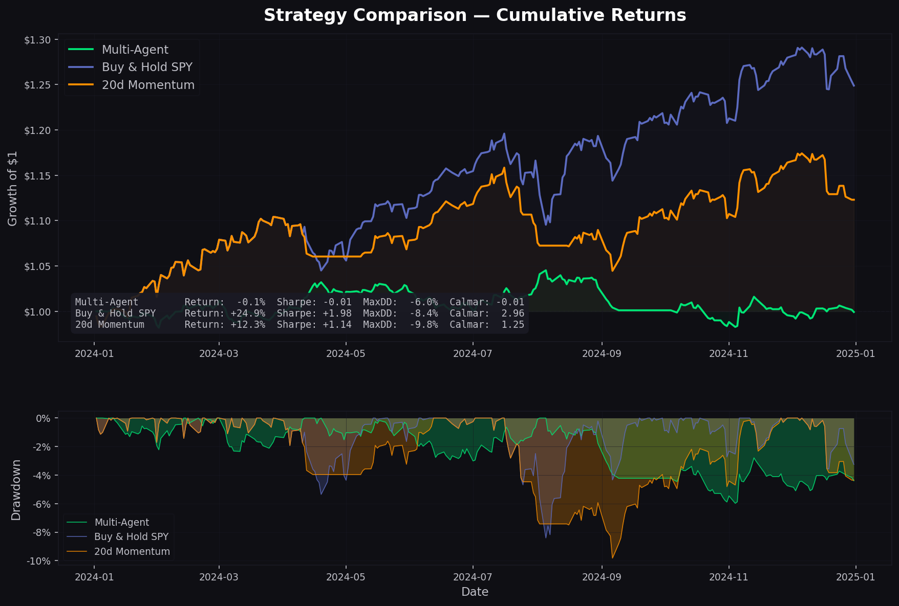

# Narrative-Driven Macro Trading System

## Overview
This project builds a multi-agent trading system that converts macroeconomic news into systematic investment decisions.

The system follows a structured pipeline:

**News → Signal Extraction → Macro Interpretation → Asset Allocation → Portfolio**

The goal is to design an interpretable and stable decision-making framework, rather than purely maximizing returns.

---

## System Design

The system consists of three main components:

- **Narrative Agent**  
  Extracts macro signals from news (Inflation, Growth, Risk)

- **Macro Agent**  
  Interprets signals into macro environments (e.g., high inflation, risk-off)

- **Asset Mapping & Portfolio**  
  Generates positions across:
  - SPY (Equities)
  - TLT (Bonds)
  - GLD (Gold)
  - UUP (Dollar)  
  with equal-weight allocation (25% each)

---

## Backtesting Setup

- Daily data (2024)
- 1-day signal lag (no look-ahead bias)
- Transaction cost: 30 bps per turnover
- Benchmark:
  - Buy & Hold SPY
  - 20-day Momentum strategy

---

## Results



The figure compares cumulative returns and drawdowns across strategies.

### Key observations:
- The multi-agent strategy shows more stable performance
- It achieves lower drawdowns
- Returns are lower in strong trending markets (e.g., SPY rally)
- The system prioritizes risk control and interpretability

---

## Ablation Insight

Removing components leads to worse performance:

- Without Macro Agent → weaker signal quality  
- Without Risk Management → larger drawdowns  

This shows each module contributes to system robustness.

---

## Run

```bash
python backtester.py
